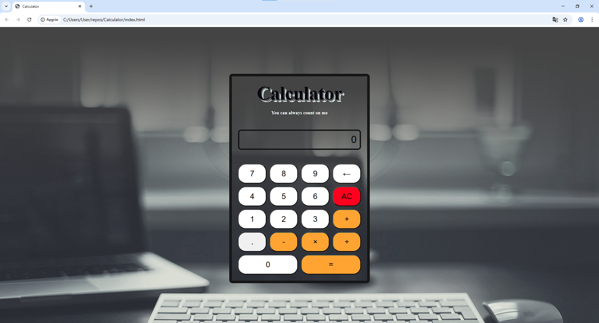

# 🧮 Web Calculator

A fully functional, browser-based arithmetic calculator built with **HTML**, **CSS**, and **Vanilla JavaScript**. 

This project was developed as part of [The Odin Project](https://www.theodinproject.com/) curriculum to demonstrate proficiency in DOM manipulation, JavaScript event handling, and application state management.

![Project Screenshot]*


## ✨ Features

- **Core Arithmetic:** Supports Addition (+), Subtraction (-), Multiplication (×), and Division (÷).
- **Operation Chaining:** Capable of handling continuous operations (e.g., `12 + 7 - 5 =`) without needing to press equals in between.
- **Keyboard Support:** Full keyboard accessibility for numbers, operators, Enter (equals), Backspace (delete), and Escape (clear).
- **Smart Rounding:** Automatically rounds long decimal results to prevent display overflow and maintain UI integrity.
- **Error Handling:** Gracefully handles edge cases such as division by zero.
- **Responsive Design:** Optimized for both desktop and mobile viewing experiences using CSS Flexbox.

## 🛠️ Technologies Used

- **HTML5**: Semantic structure.
- **CSS3**: Styling, Flexbox layout, and custom visual effects.
- **JavaScript (ES6+)**: Logic, DOM manipulation, and event delegation.

## 🚀 Getting Started

To run this project locally on your machine, follow these steps:

### Prerequisites
You need a modern web browser (Chrome, Firefox, Edge, Safari). No external libraries or Node.js installation is required.

### Installation

1. **Clone the repository:**
   ```bash
   git clone [https://github.com/themisog/Calculator.git](https://github.com/themisbog/Calculator.git)